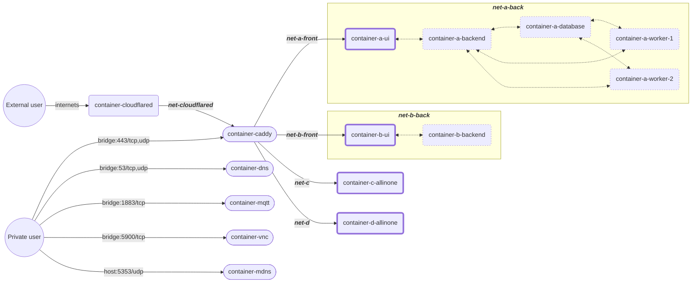

r# home-server

My docker-compose powered home server.  

I decided to make this repo public so maybe someone will find something useful for their self hosting environment configuration. Or maybe someone could come here and tell me that I'm doing something catastrophically wrong.

Russian and English languages are intermixed in this document because я заебался уже, старый readme был на английском, а новые заметки в obsidian я все писал на русском и уже слишком устал, чтобы переводить, учитывая, что в языке я не силён. 

More raw details and some check lists are stored in obsidian in "Домашний сервер" folder.


## architecture
- `docker-compose.yml` – main docker compose file
- every subdirectory contains it's own service (`docker-compose.yml`, `build/dockerfile` and read only config files mounted into container's file system). Each service's `docker-compose.yml` is included into main `docker-compose.yml`. 

All application data such as databases and mutable configs is stored inside `$APP_DATA` directory. 
`$APP_DATA` full path should be written to `.env` during setting everything up.

External data like music library or file sharing folder can be placed outside of `$APP_DATA` for convenience.

Every service can contain its own set of `.env` files. These files are represented as `*.env.example` files in the repo. Example files contain no secret info. They are copied to `*.env` files and populated with secret data during set up process. `*.env.example` files can contain persistent configuration that is not secret.

### common services
There are common services:
- caddy for reverse proxy
- cloudflared for external public access
- crowdsec with WAF and CRS rules enabled for protection
- borg for local backups
- rclone (with cron) for backing up data to the cloud

### one-shot services
One-shot services are basically scripts (e.g. download and unpack static files for AriaNG to be served by caddy) or heavy programs I rarely use (e.g. Windows VM, MusicBrainz Picard).  
They are supposed to be manually started and stopped and are marked with `profiles: [do-not-start]` so `docker compose up` doesn't run them automatically.

### networking
All incoming HTTP/WebSockets requests pass through caddy. It's convenient to have one centralized config to know exactly how anything is served. Services do not expose their HTTP ports on the host machine, they only speak HTTP through caddy.  
Non-http services (TCP/UDP, e.g. MQTT or DNS) may be exposed directly (using docker-compose `ports` option) but HTTP is preferred (e.g. MQTT over WSS, DNS over HTTPS). When exposing via HTTP is not possible, it's still preferred to proxy such traffic through caddy-l4 with crowdsec logging+remediation and maybe with TLS. 

Public external access to HTTP services is provided by cloudflared. Currently I can't rent a VPS to host non-http tunneling software.
Exposing non-http services through cloudflared requires users to run cloudflare software (cloudflared or warp) on their machines. This is not good. So non-http services are only available in private home network.  

Isolation is good. Each service should use its own docker network (usually just basic bridge network). Different services don't share networks and can't communicate to each other so compromising one service keeps other services safe. When a service is spread across multiple containers (e.g. frontend, backend, database), those  containers share a network (typically named `servicename-back`), but only front-end container should be exposed to caddy (through another network typically named `servicename-front`).  

The diagram below shows this architecture. User requests flow left-to-right. Oval-shaped containers are exposed on the host. Bold-outlined containers are exposed to caddy through separate `*-front` networks. Thin-dash-outlined containers are only available inside their `*-back` networks. 




## system preparation
This software is supposed to run on Beelink ME Mini under Debian. 
Some things have to be done before running this machine 24/7.

### BIOS
`BIOS > Chipset > PCH-IO Configuration > State After G3 > S0 State` to make machine automatically restart in case of power outage.

### File System 

При установке системы на этапе разбивки дисков на разделы выбрать опции noatime,nodiratime для монтирования /root, /media/slot4 – снижаем число записей. Позже можно добавить их в /etc/fstab руками. discard добавлять не стоит – в debian уже должен быть fstrim.timer в systemd.
Также на этом этапе нужно проследить, чтобы не было swap-раздела. То есть системный раздел создать в ручном режиме, и если нужно – создать отдельный раздел для EFI System Partition на 1GB. 

Файловая система для всего – EXT4. С ZFS или BTRFS боюсь убить SSD, у которого уж очень мал TBW. 

Шифрование диска не делаем, чтобы сервер мог без пароля подниматься сам.

eMMC не трогаем – на него уже налит резервный debian на всякий случай. 

Если накосячил с EFI/grub, то можно [переустановить grub](https://wiki.debian.org/GrubEFIReinstall), предварительно смонтировав нужный ESP-раздел. Также после косяков с ESP-разделом нужно посмотреть в blkid UUID правильного EFI-раздела и указать его в /etc/fstab вместо неправильного. 


[Убедиться, что fstrim.timer включён и смотрит на /etc/fstab](https://askubuntu.com/questions/1242796/how-to-run-fstrim-a-regularly-automatically):
```bash
systemctl status fstrim.timer
systemctl cat fstrim.service
```

Мониторинг SMART. Нужно написать скрипт, который будет регулярно гонять smartctl или `sudo nvme smart-log /dev/nvme0`. Писать отчёты в телегу или на почту. 
S.M.A.R.T. monitoring. Currently done by Scrutiny with telegram alerts, but I may decide to switch to something different: smartd with custom scripts or [beszel](https://github.com/henrygd/beszel). 


### Logging
To prevent SSD wearout logs are stored in volatile memory only.
In the future I may decide to switch to inexpensible thumb drive or cloud solutions like [betterstack](https://betterstack.com/docs/logs/syslog-setup/).

#### Volatile journald logs
```bash
sudo nano /etc/systemd/journald.conf
```
Прописать:
```toml
[Journal]
# храним в RAM
Storage=volatile
# ограничиваем доступный объём RAM
RuntimeMaxUse=768M
```
применить изменения:
```bash
systemctl restart systemd-journald
```
проверить:
```sh
sudo ncdu /run/log/journal/
sudo ncdu /var/log/journal/
```
новые логи должны писаться в /run/log/journal (tmpfs)

#### Redirect Docker container logs to journald
```bash
sudo nano /etc/docker/daemon.json
```
Прописать:
```json
{
  "log-driver": "journald"
}
```
Применить изменения:
```bash
systemctl restart docker.service
```

Проверить:
```shell
# запустить одноразовый контейнер
docker run --rm -it alpine
# в контейнере выполнить какую-нибудь команду:
echo test log output
exit

# проверить, что залогировалось в journalctl:
sudo journalctl IMAGE_NAME=alpine
```

Можно journalctl запустить вообще параллельно типа такого:
```bash
sudo journalctl -f IMAGE_NAME=alpine
```

### Disable Desktop Environment
Well, SDDM doesn't use much resources, and Plasma isn't running. So it's unnecessary to disable DE.


## install
1. Install docker according to official documentation. [For Debian](https://docs.docker.com/engine/install/debian/). [Postinstall](https://docs.docker.com/engine/install/linux-postinstall/)
2. Clone this repo: `cd ~ && clone git@github.com:kamaeff/home-server.git`
3. Run setup.sh: `cd ~/home-server && ./setup.sh`
4. Proceed by entering tokens and urls needed in configs. For vw push credentials read [this](https://github.com/dani-garcia/vaultwarden/wiki/Enabling-Mobile-Client-push-notification#enable-mobile-client-push-notification)
5. Proceed by setting rclone tokens for yandex and google drive

- setup.sh assumes it is run under Debian
- setup.sh may be used to rebuild locally-built images and pull latest images from hub

### external access
For external access use tailscale. 

```sh
# 1. Install
curl -fsSL https://tailscale.com/install.sh | sh

# 2. Enable ip forwarding
# https://tailscale.com/kb/1019/subnets?tab=linux#enable-ip-forwarding
if [ -d "/etc/sysctl.d" ]; then
    __TAILSCALE_SYSCTL_FILE="/etc/sysctl.d/99-tailscale.conf"
else
    __TAILSCALE_SYSCTL_FILE="/etc/sysctl.conf"
fi

echo "Writing ip forwarding rules to ${__TAILSCALE_SYSCTL_FILE}"

echo 'net.ipv4.ip_forward = 1' | sudo tee -a "${__TAILSCALE_SYSCTL_FILE}"
echo 'net.ipv6.conf.all.forwarding = 1' | sudo tee -a "${__TAILSCALE_SYSCTL_FILE}"
sudo sysctl -p "${__TAILSCALE_SYSCTL_FILE}"

unset __TAILSCALE_SYSCTL_FILE

# 3. Sign in and run
sudo tailscale up

# 4. Enable subnet routing and exit node
sudo tailscale set --advertise-exit-node --advertise-routes=192.168.31.0/24

```
Then go to the [tailscale admin console](https://login.tailscale.com/admin/machines) and approve routing options for the machine.


## run
`cd ~/home-server && docker compose up -d`


## update
```sh
cd ~/home-server
docker compose down
docker compose up -d # to trigger backups
docker compose down
docker compose pull
docker compose up -d
```

`setup.sh` may be used instead of `docker compose pull`. It pulls and rebuilds all images that require it. 
Use `docker compose pull <image-name>` to pull separate images. 


## backups
Separate services may back up using rclone.  
App data and file share are backed up to external SSD by borg. 
`.env` files are not backed up currently. 
